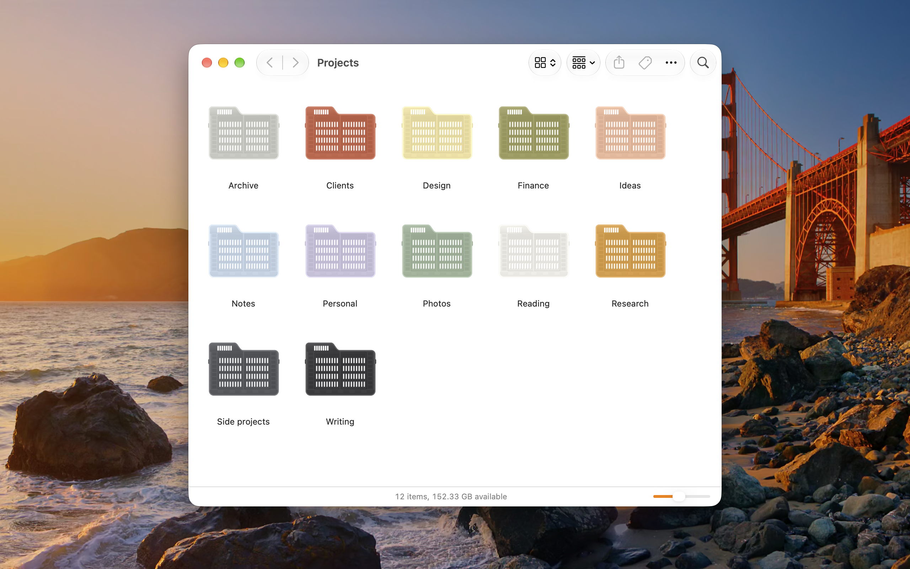
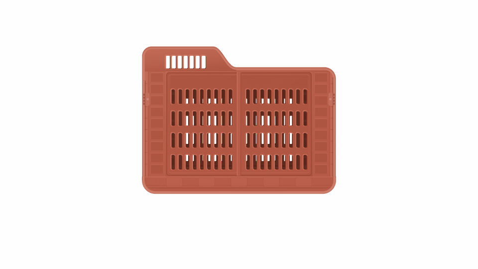
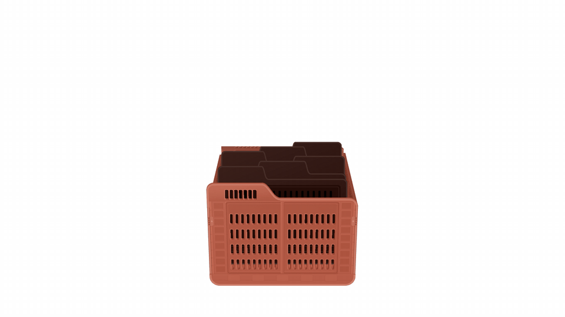
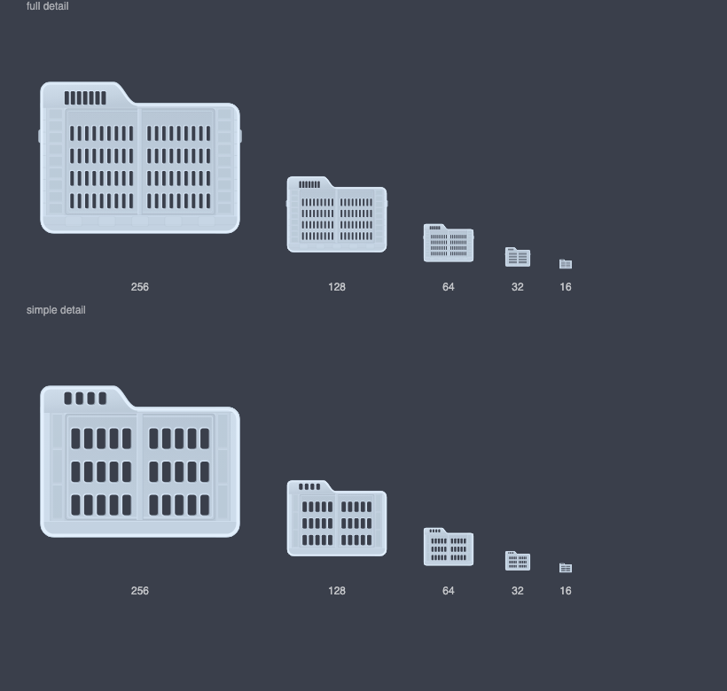
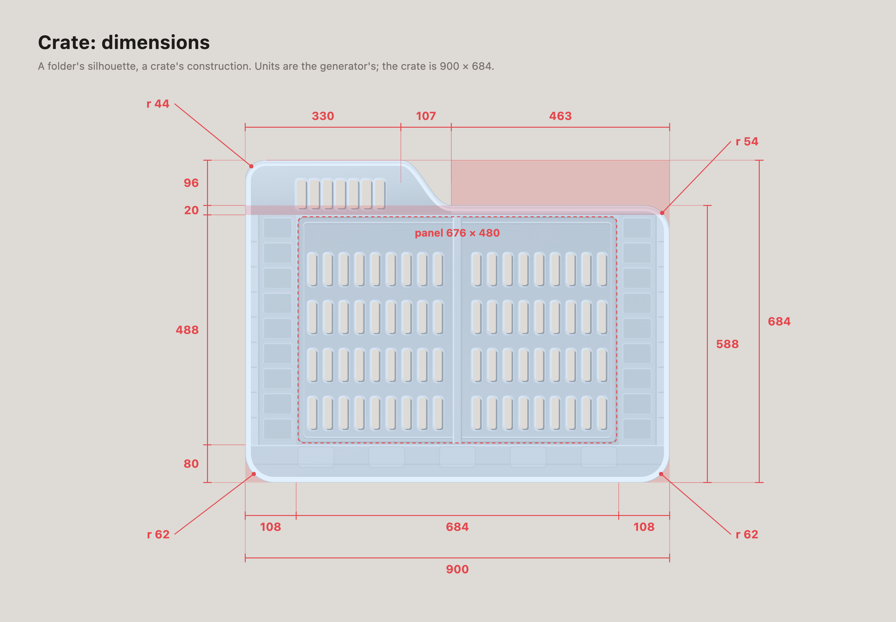
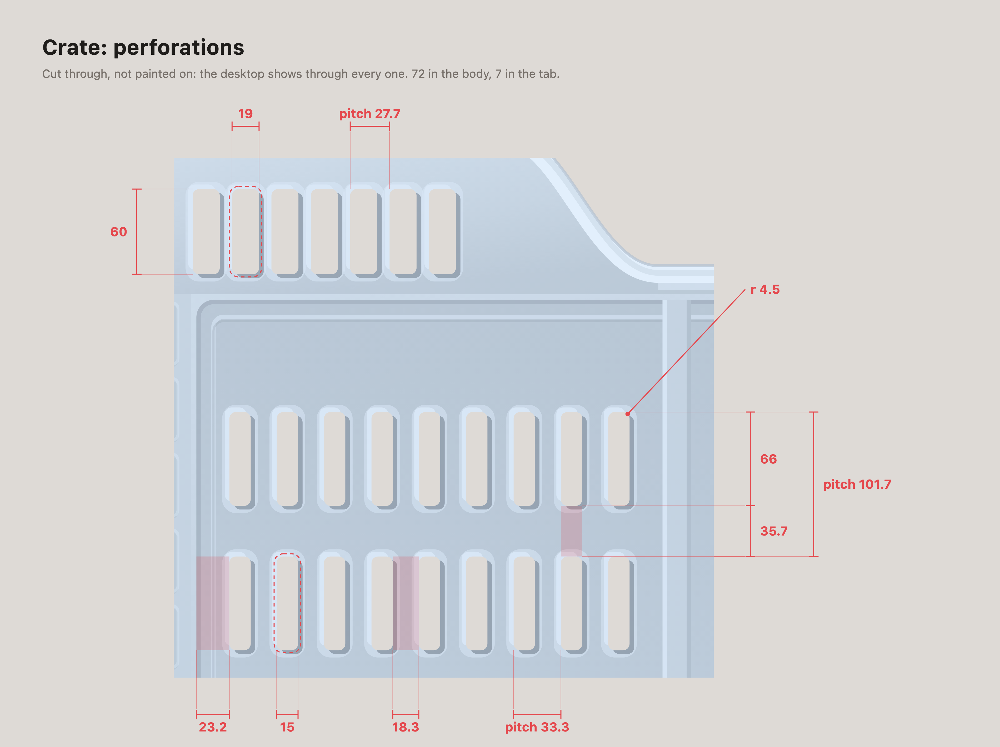

# crates

Give macOS folders custom icons — one folder, or a whole tree at once, under
a scheme that makes the result readable instead of noisy.

Ships with one style: a folding produce crate drawn in the silhouette of a
macOS folder, generated in any colour from a single hex. Bring your own style
if you'd rather.



That is a capture of Finder, not a drawing of it.

## Install

macOS only. No dependencies to install — it uses `sips`, `iconutil` and
`osascript`, all of which ship with the system. Generated styles additionally
need a Chromium-family browser to rasterise SVG (Chrome, Chromium, Edge or
Brave); pre-made `.icns` and `.png` icons don't.

```bash
git clone https://github.com/cameronhenkes/crates.git
cd crates
./crates doctor          # check your machine
ln -s "$PWD/crates" /usr/local/bin/crates    # optional, to use it anywhere
```

## Use

```bash
crates list                                  # styles and their variants
crates apply crate:rust ~/Documents/Design   # one folder
crates apply crate:sky ~/a ~/b ~/c           # several
crates apply "crate:#7B9E89" ~/Notes         # any colour you like
crates apply ./my-icon.png ~/Notes           # your own artwork
crates undo ~/Documents                      # put it all back
```

Finder aliases work too — they keep their badge and their target, and only the
displayed icon changes.

## Sweeping a whole tree

The scheme matters more than the colours once you're past a handful of
folders.

```bash
crates sweep ~/Projects --scheme inherit --depth 2 --dry-run
```

**`--scheme inherit`** gives every folder its top-level ancestor's colour, so
colour tells you *which area* something belongs to. This is the one you want
wherever your folder tree already means something.

**`--scheme shuffle`** (the default) deals a shuffled palette rather than
picking at random per folder, so all variants get used before any repeats.
Picking randomly each time clusters near-identical colours next to each other
and reads as a mistake rather than a choice.

Always `--dry-run` first. `--depth` defaults to 1 for a reason: one level
below a source directory is usually tens of thousands of folders, nearly all
of them `node_modules` and `.git` internals. (`node_modules`, `.git`,
`_archive`, `build`, `Pods`, `vendor` and dotfolders are skipped regardless.)

## Three things worth knowing

**Custom icons put a file in your folders.** macOS stores the artwork in the
resource fork of a file literally named `Icon` plus a carriage return. In a
git repo it shows up as untracked. Fix it globally once:

```bash
crates gitignore
```

**Desktop and Documents may be iCloud-synced.** Each icon is roughly a 500KB
resource fork, so sweeping a synced directory uploads real data. `crates
sweep` warns you before it does this.

**Finder caches icons.** If a change doesn't appear it has probably still
worked — `crates` restarts Finder for you, but a stubborn one may need a log
out. To check for certain, look at the resource fork rather than the screen:

```bash
ls -l "some-folder/Icon"$'\r'/..namedfork/rsrc
```

## The boot volume

You can change the Macintosh HD icon with SIP enabled, because Apple ships
`/.VolumeIcon.icns` as a symlink into the writable Data volume:

```bash
crates volume crate:anthracite      # asks for sudo
```

Replacing the *system-wide* generic folder icon is a different matter and this
tool won't help you: `GenericFolderIcon.icns` lives on a sealed, read-only
APFS volume under SIP. On Apple Silicon, writing to it means Recovery,
Permissive Security, a broken seal, and OTA updates replaced by full
reinstalls — and modern macOS resolves many icons through the `Assets.car`
beside it, so the edit may not even take. Applying icons to the folders you
actually care about is the better trade.

## It folds

The icon is the front of a crate. `docs/interactive/fold/` has the rest of it: click and it
folds the way the real one does, front, back, left, right.



It also stands open as a record crate, with folders in it that slide up to be looked at.



Both are in full quality as `docs/media/fold.mp4` and `docs/media/records.mp4`. To try them,
run `docs/interactive/fold/serve.sh`.

## Your own styles

A style is a directory under `styles/`. It either generates artwork from a
colour, or ships pre-made `.icns` files. See [docs/styles.md](docs/styles.md).

The bundled crate is parametric: every surface shade — lit face, rim, recess,
cavity — is derived from one hex in OKLab, so a new colour is an argument
rather than a repaint.

```bash
styles/crate/generate.py "#7B9E89" -o crate.svg
```

Its perforations are cut through with a mask rather than filled, so your
wallpaper shows past them:


It draws at two detail levels. The full artwork collapses into grey mush below
about 48px, so the 16 and 32px slots of the iconset use a simplified variant —
the same thing Apple does in its own icons, and the reason the small sizes stay
legible:



Measured, from the generator's own numbers:





## Credits

The crate-as-folder idea isn't mine — I saw it online, liked it, and drew my
own vector version from scratch so it could be parametric. If you know who
made the original, open an issue and I'll credit them properly. The physical
object it's based on is a folding produce crate of the sort several
manufacturers make.

MIT licensed. See [LICENSE](LICENSE).
